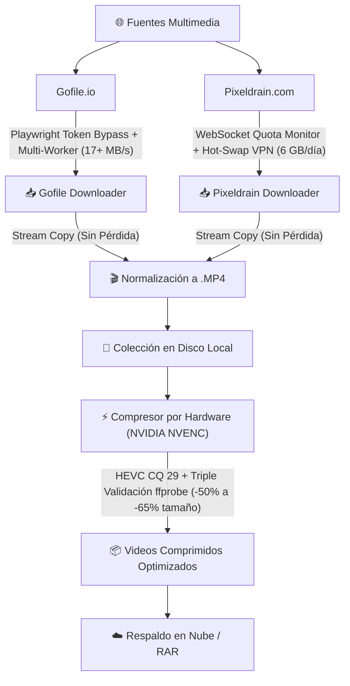

<div align="center">

# 🎬 MediaVault Toolkit
### Suite Automatizada de Descarga de Alto Rendimiento y Optimización de Video por GPU

[](https://www.python.org/)
[](https://developer.nvidia.com/video-encode-decode-gpu-support-matrix)
[](https://ffmpeg.org/)
[](LICENSE)

*Una colección integral de herramientas en Python y scripts por lotes (.bat) diseñadas para automatizar la descarga a máxima velocidad desde plataformas con limitaciones de cuota o ancho de banda (Gofile y Pixeldrain), remuxear contenedores de video sin pérdida y comprimir masivamente colecciones multimedia utilizando aceleración por hardware.*

</div>

---

## 📑 Tabla de Contenidos
1. [Visión General de las Herramientas](#-visión-general-de-las-herramientas)
2. [Estructura del Proyecto](#-estructura-del-proyecto)
3. [Instalación y Requisitos](#-instalación-y-requisitos)
4. [Módulos en Detalle](#-módulos-en-detalle)
   - [1. Descargador Gofile](#1--gofile-ultra-batch-downloader)
   - [2. Descargador Pixeldrain](#2--pixeldrain-smart-quota-downloader)
   - [3. Compresor Masivo por GPU](#3--compresor-masivo-por-hardware-gpu-nvenc)
5. [Guía de Nube y Empaquetado RAR](#-guía-de-nube-y-empaquetado-rar)
6. [Detección y Limpieza de Duplicados](#-detección-y-limpieza-de-duplicados)
7. [Licencia](#-licencia)

---

## ⚡ Visión General de las Herramientas



| Módulo | Plataforma / Función | Características Clave | Aceleración |
| :--- | :--- | :--- | :--- |
| **Gofile Downloader** | `Gofile.io` | Descargas paralelas para romper límite de 3.5 MB/s, auto-tokens con Chromium headless, auto-MP4. | Multihilo |
| **Pixeldrain Downloader** | `Pixeldrain.com` | Monitoreo en vivo de cuota por WebSockets, pausa preventiva antes de saturar 6 GB, cambio de VPN en caliente. | Asíncrono |
| **Video Compressor** | Colecciones locales | Reducción de 50-65% de espacio, calidad visual indistinguible, verificación `ffprobe` y memoria de reanudación. | GPU NVIDIA NVENC |
| **Bunkr Uploader** | `Bunkr.cr` | Subida de mayor a menor, chunks de 95 MB, reintentos infinitos si se congela o da 0, anti-duplicados por álbum. | Chunks / API |

---

## 📁 Estructura del Proyecto

```text
MediaVault-Toolkit/
│
├── README.md                      # Documentación maestra ("El Supremo")
├── requirements.txt               # Dependencias de Python (requests, rich, websockets, playwright)
├── .gitignore                     # Filtros para git (temporales, binarios, caches)
├── LICENSE                        # Licencia abierta MIT
├── launcher.bat                   # Menú unificado interactivo para Windows
│
├── gofile/                        # Módulo para Gofile.io
│   ├── gofile_downloader.py       # Script principal de descarga con Playwright
│   ├── iniciar_descarga.bat       # Lanzador rápido de un solo clic
│   └── README.md                  # Documentación específica de Gofile
│
├── pixeldrain/                    # Módulo para Pixeldrain.com
│   ├── pixeldrain_downloader.py   # Script con monitoreo de cuota WebSocket
│   ├── iniciar_pixeldrain.bat     # Lanzador rápido de un solo clic
│   └── README.md                  # Documentación específica de Pixeldrain
│
├── compressor/                    # Módulo de Compresión por Hardware
│   ├── video_compressor.py        # Motor de compresión NVENC HEVC / CPU libx265
│   ├── comprimir_videos.bat       # Lanzador rápido de compresión
│   └── README.md                  # Documentación técnica de algoritmos y perfiles
│
├── bunkr_uploader.py              # Bot subidor masivo a Bunkr con chunks y reintentos
├── subir_bunkr.bat                # Lanzador rápido de subida a Bunkr
├── comprimir_videos.bat           # Acceso directo raíz al compresor
├── gofile_downloader.py           # Enlace raíz para conveniencia
├── iniciar_descarga.bat           # Enlace raíz para conveniencia
└── video_compressor.py            # Enlace raíz para conveniencia
```

---

## 🛠️ Instalación y Requisitos

### 1. Requisitos Previos
- **Sistema Operativo:** Windows 10/11 (o Linux x86_64).
- **Python:** 3.10 o superior.
- **FFmpeg y FFprobe:** Necesarios para conversión y verificación. Si no están en el sistema, los scripts intentan descargarlos automáticamente mediante `winget` o versión portable en `bin/`.
- **GPU Dedicada (Opcional para el compresor):** NVIDIA GeForce GTX 1650 o superior / RTX Series (30/40/50 Series) con controladores actualizados para aceleración NVENC.

### 2. Instalación Automática
Todos los scripts cuentan con un instalador incorporado en el arranque. Al abrir cualquier archivo `.bat`, se comprobará si tienes Python, pip y las librerías necesarias.

Si deseas instalarlas manualmente vía consola:
```bash
git clone https://github.com/usuario/mediavault-toolkit.git
cd mediavault-toolkit
pip install -r requirements.txt
playwright install chromium
```

---

## 🔍 Módulos en Detalle

### 1. ⚡ Gofile Ultra Batch Downloader
*Ubicación:* [`gofile/`](gofile/)

Gofile limita las conexiones individuales a aproximadamente 3.5 MB/s. Este bot resuelve esa limitación ejecutando descargas simultáneas controladas, alcanzando velocidades combinadas de **17+ MB/s**.

- **Modo Dinámico:** Solicita cualquier enlace o ID de carpeta en tiempo real (`https://gofile.io/d/XXXXXX`).
- **Playwright Headless:** Obtiene los tokens de sesión de Gofile de forma transparente en segundo plano.
- **Prioridad Descendente:** Descarga los archivos de mayor a menor tamaño.
- **Reanudación Automática:** Archivos `.part` para pausar y continuar sin pérdida de datos.
- **Stream Copy:** Remuxea videos `.mov` de iPhone a `.mp4` en 1 segundo sin pérdida de calidad.

```cmd
# Ejecución directa:
iniciar_descarga.bat
```

---

### 2. 🛡️ Pixeldrain Smart Quota Downloader
*Ubicación:* [`pixeldrain/`](pixeldrain/)

Pixeldrain impone una cuota de 6 GB por día ligada a la dirección IP pública. Este bot evita descargar a ciegas y protege el límite diario.

- **Consulta WebSocket en Vivo:** Lee `wss://pixeldrain.com/api/file_stats` para saber con precisión cuántos bytes quedan.
- **Freno Preventivo:** Si el siguiente archivo pesa más que el cupo disponible, se pausa antes de comenzar para no desperdiciar megabytes ni dejar archivos truncados.
- **Rotación de VPN / IP en Caliente:** Al alcanzar los 6 GB, el bot te pide cambiar de servidor o país en tu VPN (Cloudflare WARP, ProtonVPN, etc.). Al presionar `[Enter]`, detecta la nueva IP y reanuda con **otros 6 GB frescos** de inmediato.

```cmd
# Ejecución directa:
iniciar_pixeldrain.bat
```

---

### 3. 🚀 Compresor Masivo por Hardware (GPU NVENC)
*Ubicación:* [`compressor/`](compressor/)

Diseñado para optimizar colecciones masivas de video reduciendo su peso entre un **50% y 65%** manteniendo una calidad visualmente idéntica al máster original.

- **Aceleración Extrema:** Utiliza núcleos NVIDIA NVENC (arquitecturas Ada Lovelace y Blackwell como RTX 5070), codificando videos a más de 300 FPS (~2.5 segundos por video de varios minutos).
- **Audio Intacto (Stream Copy):** El canal de audio original no se recodifica ni degrada; se transfiere idéntico bit por bit.
- **Memoria de Reanudación Automática:** Si se cancela o interrumpe (Ctrl+C, corte eléctrico), registra el progreso en `.compression_history.json` para reanudar exactamente donde se quedó.
- **Detección por Códec:** Omite automáticamente videos que ya fueron codificados en HEVC/H.265 o AV1 para nunca re-comprimir innecesariamente.
- **Triple Validación de Integridad:**
  1. Escribe a un archivo temporal `.tmp.mp4`.
  2. Valida fotogramas y duración con `ffprobe` (margen de tolerancia estricto de ±1.5s).
  3. Si la codificación falla o el archivo resultante fuera mayor, el original **jamás se modifica**.
- **Regla de Exclusión `.M`:** Protege de forma automática cualquier archivo cuyo nombre empiece con `.M` o contenga `.M` en su título.
- **Procesamiento de Mayor a Menor:** Comprime primero los archivos de mayor tamaño para liberar espacio en disco de inmediato.

```cmd
# Ejecución directa:
comprimir_videos.bat
```

---

### 4. ☁️ Bunkr Ultra Uploader (Reintentos Infinitos)
*Archivo:* [`bunkr_uploader.py`](bunkr_uploader.py)

Diseñado para resolver los problemas de congelamiento (0%), caída de sockets y errores de servidor al subir colecciones a **Bunkr.cr**.

- **Orden Descendente:** Prioriza los archivos más pesados primero (uno por uno).
- **Protocolo de Chunks (95 MB):** Divide los archivos en bloques estándar de 95 MB para máxima compatibilidad con los nodos de Bunkr.
- **Reintentos Infinitos Anti-Error:** Si un bloque se congela o da error (500/502/timeout), el bot reintenta automáticamente ese bloque hasta que se complete al 100%.
- **Rotación de Servidor:** Si un nodo de subida está caído, consulta automáticamente a la API de Bunkr y cambia a un nodo activo en caliente.
- **Anti-Duplicados por Álbum:** Sincroniza en vivo con tu álbum y mantiene un registro local (`.bunkr_upload_history.json`) para nunca re-subir videos existentes.

```cmd
# Ejecución directa:
subir_bunkr.bat
```

---

## ☁️ Guía de Nube y Empaquetado RAR

Para almacenar o compartir colecciones pesadas (40-100 GB) en la nube:

1. **No uses compresión "Ultra" en WinRAR para videos:**  
   Los videos ya están comprimidos con algoritmos de alta entropía (H.264/H.265). En WinRAR, selecciona el método **"No comprimir" (Almacenar / Store)**. Empaquetará decenas de gigabytes en segundos sin consumir CPU.
2. **Divide en Volúmenes de 5 GB:**  
   Partir el archivo en fragmentos (ej. `coleccion.part01.rar`, `coleccion.part02.rar`) protege tu subida si la conexión parpadea.
3. **Cifrado de Nombres:**  
   Si requieres privacidad, activa contraseña y marca la casilla **"Cifrar nombres de ficheros"** para evitar análisis automatizados en la nube.
4. **Opciones de Almacenamiento Gratuitas:**
   - **Gofile.io:** Sin límite de tamaño por archivo y máxima velocidad de subida/bajada.
   - **TeraBox:** Ofrece 1 TB (1,024 GB) gratuitos de almacenamiento en la nube.
   - **Telegram (Canales Privados):** Almacenamiento gratuito e ilimitado de por vida (subiendo volúmenes de hasta 1.99 GB por archivo).

---

## 🔍 Detección y Limpieza de Duplicados

Para depurar videos idénticos entre diferentes álbumes o plataformas que tienen distintos nombres o bitrates, se recomienda **Video Duplicate Finder (VDF)**:

- **Modo de Escaneo:** Usa el perfil *«Copias editadas y alteradas»* o *«Limpieza profunda»*.
- **Comparación Perceptual:** Analiza las firmas de imagen de cada fotograma, permitiendo detectar duplicados aunque uno pese 1 GB y el otro 200 MB.

---

## 📄 Licencia

Este proyecto está bajo la Licencia **MIT**. Consulta el archivo [LICENSE](LICENSE) para más detalles.
